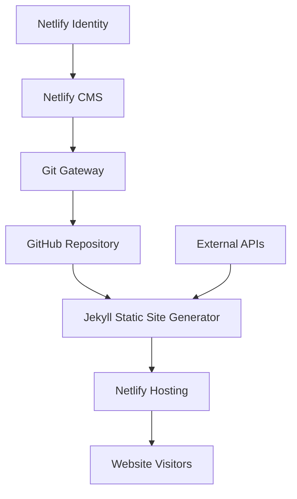

# System Patterns for Islamic Society of Sheboygan Website

## Architecture Overview

The Islamic Society of Sheboygan website follows a JAMstack architecture (JavaScript, APIs, Markup) with the following components:



## Core Components

### 1. Static Site Generator (Jekyll)

Jekyll is used to transform content, templates, and assets into a static website. This provides:
- Security (no server-side code to exploit)
- Speed (pre-rendered HTML pages)
- Simplicity (no database or server maintenance)
- GitHub Pages compatibility

**Key Jekyll Features Used:**
- Collections (`_posts`, `_events`)
- Front Matter for metadata
- Liquid templating
- Layouts and includes for component reuse
- YAML data files for structured content

### 2. Content Management (Netlify CMS)

Netlify CMS provides a user-friendly interface for content editing, with:
- Web-based admin panel at `/admin`
- Authentication via Netlify Identity
- Content updates through Git Gateway
- Custom content models for different content types
- Markdown editor with preview
- Media management
- Editorial workflow (draft, review, publish)

**Content Types:**
- Blog posts
- Events (with recurring options)
- Static pages
- Team members
- Prayer times settings

### 3. Front-End Framework (Bootstrap 5)

Bootstrap 5 is used for responsive design and UI components:
- CSS Grid and Flexbox for layouts
- Responsive navigation system
- Cards, buttons, and other UI elements
- Custom theme with Islamic Society of Sheboygan branding

### 4. External APIs

The site integrates with APIs for dynamic content:
- **Aladhan API** for prayer times calculation
- **Aladhan API** for Hijri date conversion

### 5. JavaScript Functionality

Custom JavaScript implements:
- Prayer times calculation and display
- Time zone handling for Central Time
- Calendar management
- Animations and transitions
- Form handling

## Directory Structure

```
mosque-website/
├── _config.yml                # Site configuration
├── _layouts/                  # Page templates
├── _includes/                 # Reusable components
├── _posts/                    # Blog posts
├── _events/                   # Events collection
├── _data/                     # Site data
├── assets/                    # Static assets
│   ├── css/                   # Stylesheets
│   ├── js/                    # JavaScript
│   └── images/                # Images
├── pages/                     # Static pages
├── admin/                     # Netlify CMS
└── index.html                 # Homepage
```

## Design Patterns

### Content Structure Pattern

All content follows a standard pattern with:
1. **Front Matter**: YAML metadata at the top of each file
2. **Content Body**: Markdown content
3. **Template Reference**: `layout` property in front matter

### Component Pattern

UI components are built as Jekyll includes that can be reused across pages:
- Headers and navigation
- Footers
- Prayer times displays
- Event cards
- Blog post listings

### API Integration Pattern

External API calls follow this pattern:
1. Try to load from local cache (localStorage)
2. Make API request if cache is invalid/expired
3. Process and display results
4. Store in cache for future use
5. Provide fallback content if API fails

### Responsive Design Pattern

The site follows a mobile-first approach with:
- Base styles for mobile devices
- Progressive enhancement for larger screens
- Flexible grids that adapt to screen size
- Optimized images for different viewports

## Future-Proofing Considerations

1. **Scalability**: The structure can accommodate additional content types and pages
2. **Extensibility**: New features can be added through Jekyll plugins
3. **Maintainability**: Components are modular for easy updates
4. **Performance**: Static generation keeps the site fast as content grows
5. **Content Evolution**: Netlify CMS models can be extended for new types of content
